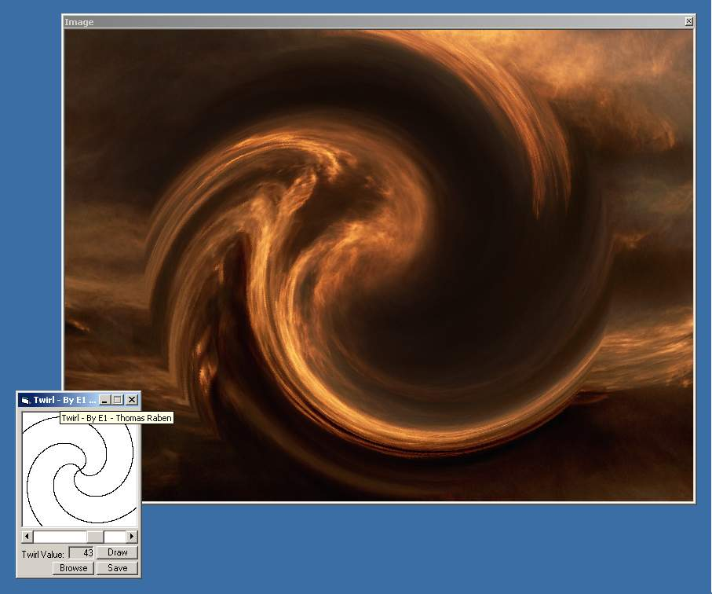



## Twirl

### Description

The code twirls an image.
 
### More Info
 
Any image of choise.

A cool effect.

             |
---                |---
**Submitted On**   |2000-11-06 09:29:26
**By**             |[Thomas Raben](https://github.com/Planet-Source-Code/PSCIndex/blob/master/ByAuthor/thomas-raben.md)
**Level**          |Advanced
**User Rating**    |4.6 (64 globes from 14 users)
**Compatibility**  |VB 5\.0, VB 6\.0
**Category**       |[Graphics](https://github.com/Planet-Source-Code/PSCIndex/blob/master/ByCategory/graphics__1-46.md)
**World**          |[Visual Basic](https://github.com/Planet-Source-Code/PSCIndex/blob/master/ByWorld/visual-basic.md)
**Archive File**   |[CODE\_UPLOAD113591162000\.zip](https://github.com/Planet-Source-Code/thomas-raben-twirl__1-12571/archive/master.zip)

